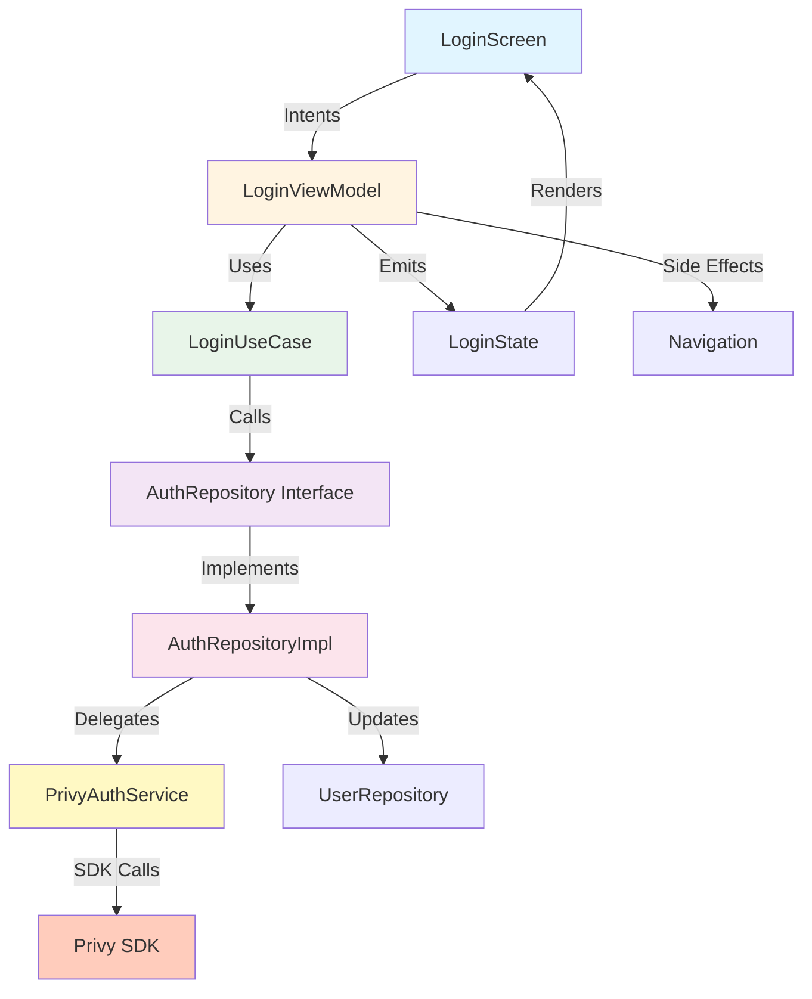

# Privy Login Screen Implementation Plan

**Date:** 2025-12-12
**Status:** 🟡 Planning
**Branch:** `feature/login-via-privy`
**Priority:** P0 (Critical - Blocking)

---

## Overview

Implement Privy authentication screen with Passkey (priority) + Google OAuth. Follows MVI + Clean Architecture pattern with Hilt DI. Enables users to authenticate and navigate to Trading screen on success.

**Timeline:** 4-6 hours
**LOC Estimate:** ~600 lines across 12 files

---

## Architecture Diagram



**Data Flow:**
```
User Tap → LoginIntent.PasskeyLogin → LoginViewModel
→ LoginUseCase → AuthRepository → PrivyAuthService
→ Privy SDK → AuthState.Authenticated
→ LoginState.Success → Navigate(Trading)
```

---

## Implementation Phases

### Phase 01: Configuration
**File:** [phase-01-configuration.md](./phase-01-configuration.md)
**Status:** ⏳ Pending
**Dependencies:** None

Configure AndroidManifest, Privy Dashboard, Digital Asset Links, and app signing.

**Key Tasks:**
- Register OAuth scheme in Privy Dashboard
- Add PrivyRedirectActivity to AndroidManifest
- Configure SHA256 fingerprint
- Set up Digital Asset Links JSON
- Store Privy App ID in BuildConfig

---

### Phase 02: Domain Layer
**File:** [phase-02-domain-layer.md](./phase-02-domain-layer.md)
**Status:** ⏳ Pending
**Dependencies:** Phase 01

Define authentication contracts and business logic.

**Key Tasks:**
- Create AuthRepository interface
- Define AuthResult sealed class
- Implement LoginUseCase (passkey + OAuth)
- Define AuthState enum

**Files:** 3 new files (~120 LOC)

---

### Phase 03: Data Layer
**File:** [phase-03-data-layer.md](./phase-03-data-layer.md)
**Status:** ⏳ Pending
**Dependencies:** Phase 02

Implement Privy SDK integration and repository.

**Key Tasks:**
- Create PrivyAuthService wrapper
- Implement AuthRepositoryImpl
- Set up Hilt modules (AuthModule)
- Handle error mapping

**Files:** 4 new files (~180 LOC)

---

### Phase 04: Presentation Layer
**File:** [phase-04-presentation-layer.md](./phase-04-presentation-layer.md)
**Status:** ⏳ Pending
**Dependencies:** Phase 03

Build MVI components and UI.

**Key Tasks:**
- Define LoginIntent sealed class
- Define LoginState data class
- Implement LoginViewModel with MviContainer
- Create LoginScreen composable
- Update NavGraph to include Login route

**Files:** 5 new files (~300 LOC)

---

## Phase Execution Order

```
Phase 01 (Configuration)
    ↓
Phase 02 (Domain Layer)
    ↓
Phase 03 (Data Layer)
    ↓
Phase 04 (Presentation Layer)
```

**Phases are sequential** - each depends on previous completion.

---

## Success Criteria

- [ ] Passkey login launches credential manager
- [ ] Google OAuth opens browser, returns to app
- [ ] Loading states displayed during auth
- [ ] Error messages shown for failures
- [ ] Successful auth navigates to Trading screen
- [ ] User object persisted via UserRepository
- [ ] No crashes on cancellation
- [ ] Clean MVI architecture followed

---

## Key Technical Decisions

| Decision | Rationale |
|----------|-----------|
| Passkey as primary auth | Faster, more secure than OAuth |
| MVI pattern | Unidirectional data flow, testable |
| Wrapper service (PrivyAuthService) | Isolates SDK, easier mocking |
| Result wrapper | Consistent error handling |
| No biometric prompt | Passkey handles this via CredentialManager |

---

## File Tree (New Files)

```
app/src/main/java/com/otistran/flash_trade/
├── domain/
│   ├── model/
│   │   └── auth-state.kt              # NEW
│   ├── repository/
│   │   └── auth-repository.kt         # NEW
│   └── usecase/
│       └── login-use-case.kt          # NEW
├── data/
│   ├── service/
│   │   └── privy-auth-service.kt      # NEW
│   └── repository/
│       └── auth-repository-impl.kt    # NEW
├── presentation/
│   └── auth/
│       ├── login-intent.kt            # NEW
│       ├── login-state.kt             # NEW
│       ├── login-side-effect.kt       # NEW
│       ├── login-view-model.kt        # NEW
│       └── login-screen.kt            # NEW
└── di/
    └── auth-module.kt                 # NEW

app/src/main/AndroidManifest.xml       # MODIFIED
```

---

## Risks & Mitigations

| Risk | Impact | Mitigation |
|------|--------|------------|
| Privy SDK initialization delay | High | Initialize SDK in Application class (parallel) |
| OAuth scheme conflicts | Medium | Use unique scheme: `com.otistran.flashtrade.privy` |
| Passkey not available | Medium | Fallback to OAuth, check CredentialManager availability |
| Digital Asset Links not verified | High | Test with `adb shell pm get-app-links com.otistran.flash_trade` |
| User cancels auth flow | Low | Handle gracefully, return to login screen |

---

## Dependencies

**External:**
- Privy SDK 0.8.0 (already in gradle)
- AndroidX Credentials 1.6.0-beta03 (for passkey)

**Internal:**
- MviContainer base class
- Result wrapper
- User domain model
- UserRepository interface

**Gradle Additions Needed:**
```kotlin
implementation("androidx.credentials:credentials:1.6.0-beta03")
implementation("androidx.credentials:credentials-play-services-auth:1.6.0-beta03")
```

---

## Testing Strategy

**Not Required** per spec, but recommended:
- Manual testing on physical device (API 28+)
- Test passkey signup → login flow
- Test OAuth Google flow
- Test error cases (cancellation, network failure)

---

## Performance Targets

| Metric | Target |
|--------|--------|
| Auth initialization | <500ms |
| Passkey response | 2-3s (user dependent) |
| OAuth flow | 3-5s (network dependent) |
| State updates | <16ms (smooth UI) |

---

## Security Considerations

- OAuth scheme validated via App Links (autoVerify=true)
- SHA256 fingerprint registered in Privy Dashboard
- No sensitive data logged
- Privy handles credential storage in TEE
- User tokens managed by Privy SDK (encrypted)

---

## Next Steps After Completion

1. Implement wallet creation flow (auto-generated via Privy)
2. Add biometric re-authentication for trades
3. Persist session tokens in encrypted DataStore
4. Add "Forgot passkey" recovery flow
5. Implement logout functionality

---

## Unresolved Questions

1. Does Privy SDK auto-initialize or require manual init in Application class?
2. What's the relying party domain for Digital Asset Links? (TBD from backend team)
3. Should we implement email/password fallback if passkey/OAuth unavailable?
4. How to handle users with existing Privy accounts migrating to app?

---

**Plan Status:** Ready for implementation
**Estimated Effort:** 4-6 hours (experienced dev)
**Blocking Issues:** None
