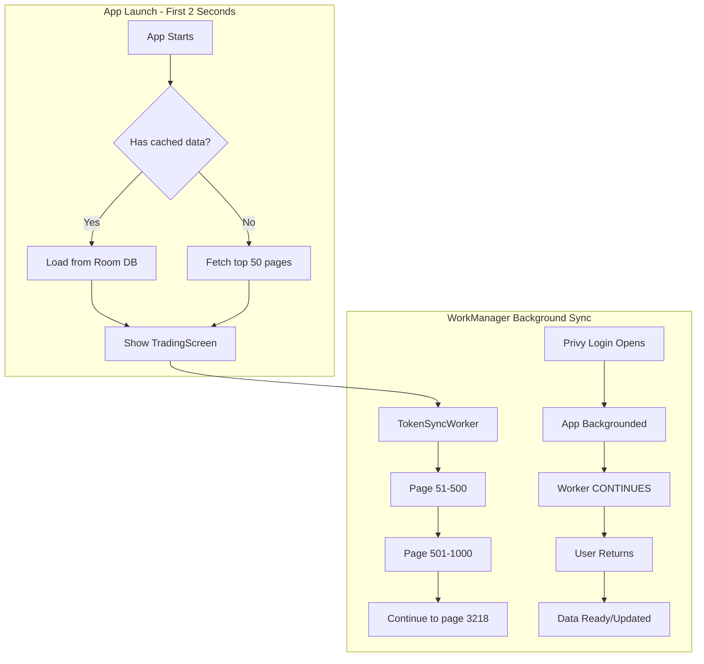

# WorkManager Token Prefetch - Brainstorm Report

**Date**: 2025-12-28
**Type**: Architecture Brainstorm
**Status**: Ready for Implementation Planning

---

## Problem Statement

### Current Issue

1. **3218 pages** (~320K tokens) need to be fetched from Kyber API
2. Current sync runs in coroutine scope → **cancelled when app backgrounds**
3. Privy login requires browser → **app goes to background**
4. User returns → **sync restarts from beginning**

### Requirements

| Requirement | Value | Constraint |
|-------------|-------|------------|
| Data scope | Full sync (320K tokens) | Non-negotiable |
| First launch | < 2 seconds | Strict UX requirement |
| Login flow | Privy (browser) | Opens external browser |
| Background behavior | App stays backgrounded | During login |
| Refresh strategy | Periodic | Every X hours |

---

## The Math Reality

```
Total pages:     3,218
Tokens/page:     100
Total tokens:    ~320,000
API delay:       100ms/page (current)
---------------------------
Min sync time:   ~5.4 minutes
With variance:   ~8-15 minutes
```

**Contradiction**: Full 320K sync + < 2s first launch = **Impossible** without trade-offs.

---

## Solution: Progressive Sync + WorkManager

### Chosen Approach

```
┌─────────────────────────────────────────────────────────────────┐
│                    PROGRESSIVE SYNC STRATEGY                     │
├─────────────────────────────────────────────────────────────────┤
│ 1. App Launch → Load top 50 pages (5K tokens) < 2 seconds       │
│ 2. WorkManager syncs remaining 3168 pages in background         │
│ 3. Privy login opens → App backgrounds → Worker CONTINUES       │
│ 4. User returns → Data partially ready, sync completes          │
└─────────────────────────────────────────────────────────────────┘
```

### Architecture



---

## Implementation Strategy

### Phase 1: Immediate Data (First 2s)

```kotlin
// TradingViewModel - Immediate load
class TradingViewModel @Inject constructor(
    private val tokenSyncManager: TokenSyncManager,
    private val getPagedTokensUseCase: GetPagedTokensUseCase
) : BaseViewModel<...>() {

    init {
        viewModelScope.launch {
            // 1. Check for immediate data (top 50 pages)
            if (tokenDao.getTokenCount() < 5000) {
                // 2. Fetch top 50 pages immediately
                fetchImmediatePages()
            }

            // 3. Start WorkManager for remaining
            tokenSyncManager.enqueueBackgroundSync()
        }
    }

    private suspend fun fetchImmediatePages() {
        // Fetch pages 1-50 in parallel
        (1..50).map { page ->
            async { kyberApi.getTokens(page = page, limit = 100) }
        }.awaitAll()
    }
}
```

### Phase 2: WorkManager Worker

```kotlin
class TokenSyncWorker(
    context: Context,
    params: WorkerParameters
) : CoroutineWorker(context, params) {

    companion object {
        const val START_PAGE_KEY = "start_page"
        const val END_PAGE_KEY = "end_page"
        const val BATCH_SIZE = 100 // pages per worker
    }

    override suspend fun doWork(): Result {
        val startPage = inputData.getInt(START_PAGE_KEY, 51)
        val endPage = inputData.getInt(END_PAGE_KEY, startPage + BATCH_SIZE)

        try {
            syncPages(startPage..endPage)

            // Enqueue next batch if not complete
            if (endPage < 3218) {
                enqueueNextBatch(endPage + 1)
            }

            return Result.success()
        } catch (e: Exception) {
            return Result.retry()
        }
    }

    private suspend fun syncPages(range: IntRange) {
        range.forEach { page ->
            kyberApi.getTokens(page = page, limit = 100)
                .also { response ->
                    tokenDao.insertTokens(response.data.toEntityList())
                }
            delay(100) // Rate limiting
        }
    }

    private fun enqueueNextBatch(nextStartPage: Int) {
        val request = OneTimeWorkRequestBuilder<TokenSyncWorker>()
            .setInputData(
                workDataOf(
                    START_PAGE_KEY to nextStartPage,
                    END_PAGE_KEY to minOf(nextStartPage + BATCH_SIZE, 3218)
                )
            )
            .setConstraints(
                Constraints.Builder()
                    .setRequiredNetworkType(NetworkType.CONNECTED)
                    .setRequiresBatteryNotLow(true)
                    .build()
            )
            .build()

        WorkManager.getInstance(applicationContext).enqueue(request)
    }
}
```

### Phase 3: Sync Manager Integration

```kotlin
@Singleton
class TokenSyncManagerImpl @Inject constructor(
    private val context: Context,
    private val workManager: WorkManager
) : TokenSyncManager {

    companion object {
        private const val SYNC_WORK_NAME = "token_sync_work"
    }

    override suspend fun checkAndStartSync() {
        if (shouldSync()) {
            enqueueBackgroundSync()
        }
    }

    fun enqueueBackgroundSync() {
        // Check if already running
        val existingWork = workManager.getWorkInfosForUniqueWork(SYNC_WORK_NAME).first()
        if (existingWork.any { !it.state.isFinished }) {
            return // Already running
        }

        // Enqueue first batch
        val request = OneTimeWorkRequestBuilder<TokenSyncWorker>()
            .setInputData(
                workDataOf(
                    START_PAGE_KEY to 51,
                    END_PAGE_KEY to 150
                )
            )
            .setConstraints(
                Constraints.Builder()
                    .setRequiredNetworkType(NetworkType.CONNECTED)
                    .build()
            )
            .build()

        workManager.enqueueUniqueWork(
            SYNC_WORK_NAME,
            ExistingWorkPolicy.KEEP,
            request
        )
    }

    suspend fun getSyncProgress(): SyncProgress {
        val workInfo = workManager.getWorkInfosForUniqueWork(SYNC_WORK_NAME).first()
        val tokenCount = tokenDao.getTokenCount()
        val estimatedTotal = 320_000

        return SyncProgress(
            tokensFetched = tokenCount,
            totalTokens = estimatedTotal,
            percentage = (tokenCount.toFloat() / estimatedTotal * 100).toInt(),
            isRunning = workInfo.any { it.state == WorkInfo.State.RUNNING }
        )
    }
}
```

---

## WorkManager Constraints & Behaviors

### Important Limitations

| Behavior | Impact | Mitigation |
|----------|--------|------------|
| Not immediate execution | Worker may delay minutes | Fetch top 50 pages immediately |
| 10-minute timeout | Single worker limited | Batch into multiple workers |
| Doze mode | May defer to later | Accept, show progress UI |
| Battery saver | May restrict execution | Add battery constraint |

### What WorkManager DOES Solve

✓ Survives app backgrounding (Privy login)
✓ Survives app termination (worst case)
✓ Respects system resources
✓ Observable via `WorkInfo`
✓ Retry logic built-in

---

## Performance Optimizations

### 1. Parallel API Requests (Immediate Phase)

```kotlin
// Fetch 50 pages in ~2 seconds using coroutines
private suspend fun fetchImmediatePages() {
    coroutineScope {
        (1..50).map { page ->
            async(Dispatchers.IO) {
                kyberApi.getTokens(page = page, limit = 100)
            }
        }.awaitAll()
    }
}
```

### 2. Batch Insert (Database)

```kotlin
// Insert all tokens from page at once
suspend fun syncPages(range: IntRange) {
    val allTokens = mutableListOf<TokenEntity>()

    range.forEach { page ->
        val response = kyberApi.getTokens(page = page, limit = 100)
        allTokens.addAll(response.data.toEntityList())
    }

    // Single bulk insert
    tokenDao.insertTokens(allTokens)
}
```

### 3. Checkpoint System

```kotlin
data class SyncCheckpoint(
    val lastPageSynced: Int,
    val lastSyncTime: Long,
    val totalTokensFetched: Int
)

// Save progress in DataStore
context.dataStore.edit { preferences ->
    preferences[intPreferencesKey("last_sync_page")] = currentPage
}
```

---

## UI Progress Indication

```kotlin
@Composable
fun TradingScreen(viewModel: TradingViewModel) {
    val syncProgress by viewModel.syncProgress.collectAsState()

    if (syncProgress.isRunning && syncProgress.percentage < 100) {
        LinearProgressIndicator(
            progress = { syncProgress.percentage / 100f },
            modifier = Modifier.fillMaxWidth()
        )

        Text(
            text = "${syncProgress.tokensFetched.formatNumber()} / ${syncProgress.totalTokens.formatNumber()} tokens synced",
            style = MaterialTheme.typography.bodySmall
        )
    }
}
```

---

## Alternatives Considered

### Alternative 1: Foreground Service

| Pros | Cons |
|------|------|
| More reliable | User-visible notification |
| Harder to kill | Battery drain |
| Immediate execution | More complex |

**Verdict**: Overkill. WorkManager sufficient.

### Alternative 2: Pre-Bundle in APK

| Pros | Cons |
|------|------|
| < 500ms launch | Stale data |
| No API calls | Larger APK |
| Full offline | CI/CD complexity |

**Verdict**: Consider if APK size acceptable.

### Alternative 3: Server-Side Stream

| Pros | Cons |
|------|------|
| Single connection | API changes required |
| Server-controlled pace | SSE support needed |
| Resumable | Backend dependency |

**Verdict**: Best if API can be modified.

---

## Success Metrics

| Metric | Target | How to Measure |
|--------|--------|----------------|
| First launch time | < 2 seconds | Time to TradingScreen render |
| Sync completion | < 15 minutes | WorkInfo.State.SUCCEEDED |
| Background resume | 100% | Worker continues after Privy |
| API rate limit | 0 errors | Monitor 429 responses |

---

## Risks & Mitigations

| Risk | Impact | Mitigation |
|------|--------|------------|
| WorkManager delayed | Slow initial data | Immediate fetch of top 50 |
| Worker timeout (10min) | Incomplete sync | Multiple workers |
| API rate limit | Sync failure | Exponential backoff |
| Database size | Storage growth | Cleanup stale tokens |
| Battery drain | User complaints | Battery constraints |

---

## Implementation Checklist

### Phase 1: Core WorkManager Integration
- [ ] Create `TokenSyncWorker` class
- [ ] Add WorkManager dependency to `build.gradle.kts`
- [ ] Implement batch sync logic (100 pages/batch)
- [ ] Add worker chaining for full sync
- [ ] Create sync checkpoint system

### Phase 2: Immediate Data Load
- [ ] Implement top-50 parallel fetch
- [ ] Add Room database migration if needed
- [ ] Update `TradingViewModel` initialization
- [ ] Add loading state handling

### Phase 3: UI & Progress
- [ ] Add sync progress indicator
- [ ] Show token count badge
- [ ] Add sync status in settings
- [ ] Implement pause/resume capability

### Phase 4: Optimization
- [ ] Add bulk insert optimization
- [ ] Implement exponential backoff
- [ ] Add network quality detection
- [ ] Cache invalidation strategy

---

## Next Steps

1. **Review this report** and confirm approach
2. **Create detailed implementation plan** using `/plan` command
3. **Implement Phase 1** (WorkManager core)
4. **Test with Privy login flow**
5. **Iterate based on performance**

---

## Unresolved Questions

1. **Sync frequency**: How often should full refresh occur? (6 hours? 12 hours? 24 hours?)
2. **Stale data tolerance**: Is pre-bundling in APK acceptable for first-launch?
3. **API rate limiting**: Should we implement aggressive backoff or is current 100ms sufficient?
4. **Server-side sync**: Any possibility of backend supporting bulk export or SSE?

---

*Report generated by brainstorm agent*
